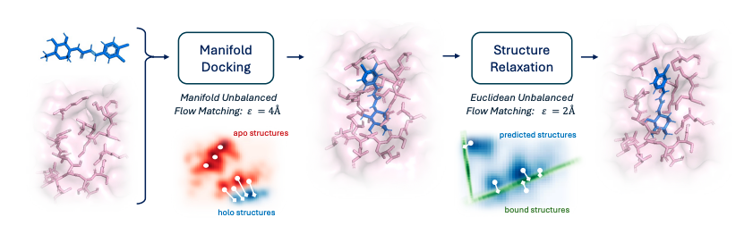

# Composing Unbalanced Flows for Flexible Docking and Relaxation (ICLR' 25 Oral)



Implementation of FlexDock for flexible docking and relaxation by Gabriele Corso*, Vignesh Ram Somnath*, Noah Getz*, Regina Barzilay, Tommi Jaakkola, Andreas Krause.
This repository contains code and instructions to run the method.

We do not expect **FlexDock** to replace flexible docking pipelines but rather hope some of the ideas provide improvements in related tasks and larger models.

**Note**: This codebase is under active development to make it more user-friendly from the state at submission and as such we expect minor bugs in this transition period. If you encounter any issues or have questions, feel free to open an issue!

Planned Updates:

- [ ] Clean instructions for training data pipelines for relaxation and filtering
- [ ] Complete transition to configs
- [ ] Mixed-Precision Training


<details><summary><b>Citation</b></summary>
If you use this code or model in your research, please cite the following paper:

```
@inproceedings{
corso2025composing,
title={Composing Unbalanced Flows for Flexible Docking and Relaxation},
author={Gabriele Corso and Vignesh Ram Somnath and Noah Getz and Regina Barzilay and Tommi Jaakkola and Andreas Krause},
booktitle={The Thirteenth International Conference on Learning Representations},
year={2025},
url={https://openreview.net/forum?id=gHLWTzKiZV}
}
```
</details>


## Main Changes from DiffDock
* Complete integration with [PyTorch Lightning](https://lightning.ai/docs/pytorch/stable/)
* Support for equivariant variants of LayerNorm which address the unstable training of DiffDock models
* Relevant changes for Fully-Sharded Data Parallel (FSDP) and other distributed training strategies
* Mixed-Precision Training (coming soon!)

We hope this also provides a useful starting point for researchers looking to scale their models on limited resources!


## Usage

### Setup Environment

We will set up the environment using [Anaconda](https://docs.anaconda.com/anaconda/install/index.html). Clone the
current repo:

    git clone https://github.com/vsomnath/flexdock.git

To set up an appropriate environment, navigate to the root of the repository and run the following commands:

    bash build_env.sh

See [conda documentation](https://conda.io/projects/conda/en/latest/commands/env/create.html) for more information.

## Docking Predictions

### Preparing input files

1. Prepare a input CSV similar to `examples/inference_pdbbind_5.csv`, with the appropriate columns.
2. Extract ESM embeddings (this manual extraction will be phased out soon).
(Check Datasets section below for extracting ESM embeddings)

### Downloading Model

The models can be downloaded from [here](https://drive.google.com/file/d/1IzFMbN-LFiHThWkK3xowZpR0HTugVwsS/view?usp=sharing).
Upon extraction, you should have `flexdock_models/docking` and similarly for `filtering` and `relaxation`.

### Running the model

The basic command for running inference with **FlexDock** is:
```
python scripts/predict.py \
    --input_csv [PATH] \
    --use_fast_sampling \
    --esm_embeddings_path [ESM_PATH] \
    --docking_model_dir flexdock_models/docking \
    --docking_ckpt best_inference_epoch_model.pt \
    --use_ema_weights \
    --model_in_old_version \
    --filtering_model_dir flexdock_models/filtering \
    --filtering_ckpt best_model.pt \
    --run_relaxation \
    --relax_model_dir flexdock_models/relaxation \
    --relax_ckpt best_inference_epoch_model.pt \
    --samples_per_complex 10 \
    --inference_steps 20 \
    --pocket_reduction \
    --pocket_buffer 20.0 \
    --pocket_min_size 1 \
    --only_nearby_residues_atomic
```

Additional command line arguments include (see `default_inference_args.yaml`):
* `diff_temp_*`: low temperature sampling parameters for different degrees of freedom
* `initial_noise_std_proportion`: Initial translation noise factor


## Datasets and Preprocessing

### Datasets
* **PDBBind**: Download the processed complexes from [Drive](https://drive.google.com/file/d/12Bf4j2phnXYPk1PUvXE1fVPntVDpvCst/view?usp=sharing), containing the apo (generated with ESMFold), holo structures and ligands.

### Preprocessing

1. To extract ESM embeddings, follow the same steps as DiffDock until the final step.
In the final step, please run:

        python datasets/esm_embeddings_to_pt.py --cache_individual --output_path data/esm_embeddings

2. To preprocess the data, run:

```
python preprocess_data.py \
    --data_dir [DATA_DIR] \
    --cache_path [CACHE_PATH] \
    --complexes_file [SPLIT_PATH] \
    --esm_embeddings_path [ESM_PATH] \
    --num_workers 20
```

## Training

We are currently transitioning to a config based system, and only the docking models can be trained with a config.

### Docking

To train the docking model, run

        python train/train_config.py configs/example_config.yaml trainer.devices=1

### Filtering and Relaxation

To train the filtering and relaxation models, use the provided config in `flexdock_models` and run:

        python train/train.py --config [CONFIG_PATH]

We expect to have transitioned to the config based system for all models in the next couple of weeks

## License

The code and model weights are released under MIT license. See the LICENSE file for details.

## Citations <a name="citations"></a>

If you use this code or model in your research, please cite the following paper:

```
@inproceedings{
corso2025composing,
title={Composing Unbalanced Flows for Flexible Docking and Relaxation},
author={Gabriele Corso and Vignesh Ram Somnath and Noah Getz and Regina Barzilay and Tommi Jaakkola and Andreas Krause},
booktitle={The Thirteenth International Conference on Learning Representations},
year={2025},
url={https://openreview.net/forum?id=gHLWTzKiZV}
}
```

## Acknowledgements

We sincerely thank members from the Valence team, namely Farimah Poursafaei, Nikhil Shenoy and Daniel Cutting for their help with improving the codebase.
